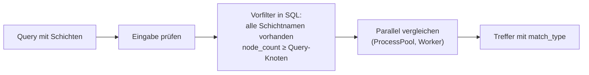

# gen-db

Biological Network Database mit PostgreSQL-Backend, FastAPI-REST-API und Web-Frontend zur Analyse biologischer Netzwerke mittels Subgraph Algorithmus.

[](https://www.python.org/)
[](tests/)
[](doc/coverage/index.html)
[](doc/coverage/index.html)

## Inhaltsverzeichnis

- [Voraussetzungen](#voraussetzungen)
- [Installation](#installation)
- [Abhängigkeiten](#abhängigkeiten)
- [SQL-Struktur](#sql-strutkur)
- [1.000.000 Netzwerke](#1000000-netzwerke)
- [Server starten](#server-starten)
- [Netzwerke suchen](#netzwerke-suchen)
- [Multi-Omics-API](#multi-omics-api)
- [Universelle Kodierung](#universelle-kodierung-universal-coding)
- [Automatisch testen](#automatisch-testen)
- [Wahrheit: Pyreverse](#wahrheit-pyreverse)
- [Erwerb Gen-DB](#erwerb-gen-db)

## Voraussetzungen

Damit das Projekt lokal korrekt gestartet werden kann, werden eine aktuelle Python-Version und eine PostgreSQL-Instanz benötigt.

- Python 3.12
- PostgreSQL (lokal, portable von https://www.enterprisedb.com/download-postgresql-binaries oder via Docker)

## Installation

Mit den folgenden Schritten wird die lokale Datenbank für das Projekt vorbereitet und das Schema initialisiert.

Befehle:
```bash
# 1. Mit UTF-8 neu initialisieren
mkdir C:\Users\Internet\Downloads\postgresql-18.6-5-windows-x64-binaries\pgsql\data

C:\Users\Internet\Downloads\postgresql-18.6-5-windows-x64-binaries\pgsql\bin\initdb.exe `
  -D C:\Users\Internet\Downloads\postgresql-18.6-5-windows-x64-binaries\pgsql\data `
  -U postgres `
  -A trust `
  --encoding=UTF8 `
  --locale=C

# 2. Server starten
C:\Users\Internet\Downloads\postgresql-18.6-5-windows-x64-binaries\pgsql\bin\pg_ctl.exe -D C:\Users\Internet\Downloads\postgresql-18.6-5-windows-x64-binaries\pgsql\data -l C:\Users\Internet\Downloads\postgresql-18.6-5-windows-x64-binaries\pgsql\logfile.log start

# 3. Datenbank mit UTF-8 erstellen
C:\Users\Internet\Downloads\postgresql-18.6-5-windows-x64-binaries\pgsql\bin\psql.exe -U postgres -h localhost -c "CREATE DATABASE gendb WITH ENCODING='UTF8' LC_COLLATE='C' LC_CTYPE='C';"

# 4. Schema initialisieren
cd C:\Users\sepp5\Git\gen-db
C:\Users\Internet\Downloads\postgresql-18.6-5-windows-x64-binaries\pgsql\bin\psql.exe -U postgres -h localhost -d gendb -f init-db.sql
```

## Abhängigkeiten

Für die Netzwerkanalyse wird zusätzlich der Subgraph-Algorithmus installiert, der über die Projektabhängigkeiten eingebunden wird:

```bash
pip install -e ".[dev]"
```
Es wird die API des Subgraph Algorithmus genutzt mit `Subgraph().compare_graphs(A, B)`.

### Optional: C++-Implementierung (csubgraph)

Die Suche nutzt die C++-Implementierung aus dem Repository `csubgraph` als Bibliothek, wenn in der `.env` der Pfad zu `libsubgraphlib.a` gesetzt ist. Ist `CSUBGRAPH_LIB_PATH` nicht gesetzt (leer oder auskommentiert), wird die Python-Implementierung verwendet.

```env
# Datei libsubgraphlib.a oder Projekt-/Build-Ordner von csubgraph; leer = Python
CSUBGRAPH_LIB_PATH=C:/Users/<name>/Git/csubgraph/build/libsubgraphlib.a
```

Der Pfad darf direkt auf `libsubgraphlib.a` zeigen oder auf einen Ordner, in dem sie liegt (Projektordner, `build/`, `build/Release`). Eine statische Bibliothek kann Python nicht direkt laden. Beim ersten Gebrauch linkt Gen-DB sie deshalb mit einem kleinen C-Wrapper (`src/backend/native/csubgraph_shim.cpp`) zu einer DLL/`.so` und ruft sie per `ctypes` direkt im Worker-Prozess auf, ohne Prozessstart und ohne JSON je Vergleich. Voraussetzungen:

- ein C++-Compiler im `PATH` (oder über die Umgebungsvariable `CXX`), unter Windows derselbe MinGW-w64 `g++`, mit dem `libsubgraphlib.a` gebaut wurde
- die Bibliothek muss mit diesem Compiler gebaut sein; der Header `SubgraphAlgorithm.h` wird neben der Bibliothek (Projektordner) gesucht, sonst wird die mitgelieferte Kopie in `src/backend/native/` verwendet

Die gelinkte Wrapper-Bibliothek liegt im Cache-Ordner `<temp>/gen-db-csubgraph` (änderbar mit `GENDB_NATIVE_CACHE`) und wird nur neu gebaut, wenn sich `libsubgraphlib.a`, der Wrapper oder der Header ändern. Der Build läuft einmalig beim Start, bevor die Worker-Prozesse erzeugt werden. Ist die Bibliothek nicht auffindbar oder nicht nutzbar (kein Compiler, Link- oder Ladefehler), steht der Grund als Warnung im Log und es wird die Python-Implementierung verwendet. Beim Start steht im Log, welcher Algorithmus verwendet wird. Die Ergebnisse der C++-Version werden auf die Python-Werte abgebildet (`KEEP_B` → `keep_B`, `IDENTICAL` → `equal_keep_A`/`equal_keep_B`), sodass die Suche in `crud.py` unverändert bleibt. Im Docker-Image ist csubgraph nicht enthalten; dort läuft die Python-Implementierung.

Hinweis: Das CMake-Projekt von csubgraph baut die Bibliothek mit `--coverage` (gcov). Das wird beim Linken erkannt und berücksichtigt, die Bibliothek schreibt dann beim Prozessende `.gcda`-Dateien. Für den Produktivbetrieb und für Messungen ist eine Bibliothek ohne Coverage-Instrumentierung etwas schneller.

#### Backend-Experiment

Der Vergleich von Python und C++ lässt sich mit derselben Datenbank und denselben Queries ausführen:

```powershell
python src/experiment_search_backends.py
```

Das Experiment verwendet standardmäßig sechs mit Seed `42` ausgewählte Queries mit mindestens 15 Knoten und zwei Worker je Backend. Es prüft, welches Backend tatsächlich in den Workern aktiv ist, vergleicht die Treffer-IDs und zählt fehlgeschlagene Vergleiche. Die Laufzeit umfasst die vollständige Suche einschließlich Datenbankzugriff, Worker-Kommunikation und Ergebnisaufbau. Ein separater Mikrobenchmark vergleicht 200 identische Zufallsgraphpaare und misst zusätzlich einen trivialen Library-Aufruf.

Im abgeschlossenen Messlauf vom 7. Oktober 2026 durchliefen beide Backends jeweils `931.899` Kandidaten. Python benötigte insgesamt `1.180,28 s`, die C++-Library `185,62 s`; das entspricht einem Ende-zu-Ende-Speedup von `6,36×`. Für jede der sechs Queries war die C++-Suche schneller, die Treffer-IDs waren identisch und es traten keine fehlgeschlagenen Vergleiche auf. Im Mikrobenchmark betrug die mittlere Zeit je Einzelvergleich `2,694 ms` für Python und `0,074 ms` für C++; ein trivialer `1×1`-Library-Aufruf lag bei `0,018 ms`.

Diese Messwerte gelten für sechs einzelne Suchläufe auf synthetischen Daten unter Windows 11 mit zwei Workern. Sie sind ein Ergebnis dieses Versuchsaufbaus, keine allgemeine Leistungsgarantie; insbesondere fehlen Wiederholungen, Konfidenzintervalle, reale biologische Daten und Messungen auf weiteren Plattformen. Ältere Messungen über die C++-CLI verwendeten einen anderen Aufrufpfad mit Prozessstart und JSON je Vergleich und sind nicht mit dem hier beschriebenen Library-Ergebnis gleichzusetzen.

Die Resultate werden unter `src/results/` mit Zeitstempel abgelegt. Die vorhandene JSON-Datei kann ohne erneuten Suchlauf für neue Diagramme und LaTeX-Tabellen verwendet werden:

```powershell
python src/experiment_search_backends.py --plot-from src/results/search_backends_20261007_104804.json
```

Mit `--queries 2` kann vor einer längeren Messung ein kleiner Vorabtest ausgeführt werden. Während des Experiments sollte der API-Server beendet sein, damit er nicht mit den Worker-Prozessen um Ressourcen konkurriert.

### Multi-Omics

Ein Multi-Omics-Netzwerk besteht aus mehreren Schichten (z. B. Transkriptom, Proteom, Metabolom) über denselben Knoten. Jede Schicht ist eine eigene Adjazenzmatrix, alle Schichten teilen sich die `node_labels`. Gespeichert wird es in den Tabellen `omics_networks` und `omics_layers`; die Metadaten stehen wie bei jedem Netzwerk in `biological_networks` (`edge_count` ist die Summe über alle Schichten, Löschen entfernt per `CASCADE` auch die Schichten). Die Zeilenkomponenten je Schicht liegen als `BIGINT[]` vor und passen bis 63 Knoten hinein.

| Endpoint | Zweck |
|---|---|
| `POST /api/multiomics` | Netzwerk mit Schichten anlegen (`layers`: Liste aus `layer_name` und `adjacency_matrix`) |
| `GET /api/multiomics/{network_id}` | Netzwerk mit allen Schichten lesen |
| `POST /api/multiomics/search` | Suche: Query-Schichten (nach Name) in allen Netzwerken, die diese Schichten besitzen |

Die Suche kennt zwei Modi (`mode`): `coherent` (Standard) verlangt, dass alle Schichten der Query an derselben Position des Kandidaten übereinstimmen, `independent` erlaubt je Schicht eine eigene Position. `coherent` ist strenger; jeder kohärente Treffer ist auch ein unabhängiger Treffer. Ungültige Eingaben (doppelte Schichtnamen, nicht quadratische oder nicht binäre Matrizen, mehr als 63 Knoten, falsche Zahl an Labels) liefern `422`.

Der Algorithmus wird **genauso wie der Subgraph Algorithmus über die `.env`** ausgewählt, es gibt keine neue Einstellung: Zeigt `CSUBGRAPH_LIB_PATH` auf eine `libsubgraphlib.a`, die `MultiOmics` enthält (csubgraph mit `MultiOmics.cpp`), läuft die Suche über die C++-Klasse `MultiOmics`. Dafür wird ein zweiter C-Wrapper (`src/backend/native/csubgraph_omics_shim.cpp`) mit derselben Bibliothek gelinkt und per `ctypes` im Worker-Prozess aufgerufen, gebaut und gecacht wie der Wrapper für den Einzelvergleich. Ist der Pfad nicht gesetzt oder die Bibliothek nicht nutzbar, steht der Grund als Warnung im Log und es läuft die Python-Implementierung (`src/backend/multiomics_python.py`). Eine ältere `libsubgraphlib.a` ohne `MultiOmics` betrifft nur Multi-Omics: der Einzelvergleich bleibt bei C++, Multi-Omics nutzt Python. Nach dem Aktualisieren von csubgraph muss die Bibliothek neu gebaut werden. Beim Start steht im Log, welcher Algorithmus für Multi-Omics gewählt wurde.

#### Multi-Omics-Experiment

Das Experiment `src/experiment_search_multiomics.py` vergleicht die Python- und die C++-Implementierung der Multi-Omics-Suche und besteht aus sechs Teilexperimenten: Korrektheit (ohne Datenbank, inklusive Invarianten), Mikro-Benchmark je Einzelvergleich (Schichtzahl, Knotenzahl, Modus), Ende-zu-Ende-Suche (Anfragengitter, Wiederholungen, Phasen, Speedup mit Konfidenzintervall, Trefferquote gegen bekannte Lösungen), Worker-Skalierung, Chunk-Größe und Datenbankgröße.

```powershell
python src/experiment_search_multiomics.py --quick      # kleiner Vorabtest
python src/experiment_search_multiomics.py              # vollständig (mehrere Stunden)
python src/experiment_search_multiomics.py --only correctness micro
python src/experiment_search_multiomics.py --plot-from src/results/search_multiomics_<zeit>.json
python src/experiment_search_multiomics.py --cleanup-only
```

Das Experiment legt synthetische Netzwerke mit dem Typ `multi_omics_experiment` in der Datenbank an (Zufallsnetzwerke und je eingebetteter Anfrage Netzwerke mit bekannter Lösung); andere Netzwerke bleiben unverändert. `--cleanup` entfernt die Experiment-Netzwerke am Ende, `--rebuild-data` erzeugt sie neu. Die Ergebnisse (JSON, PDF, Textbericht, LaTeX-Tabellen, `plot11_…` bis `plot26_…`) liegen unter `src/results/`. Das Skript ist in `pyproject.toml` unter `omit` eingetragen und zählt nicht zur Testabdeckung.

Die Kandidaten werden nur nach der Knotenzahl (`node_count >= n_Query`) und dem Vorhandensein aller Query-Schichten vorgefiltert. Eine Vorauswahl nach der Kantenzahl gibt es hier bewusst nicht: Mit der Relation des Algorithmus kann ein Graph mit mehr Kanten in einem Graphen mit weniger Kanten enthalten sein (Beispiel in `tests/test_multiomics_python.py::test_edge_count_is_not_monotone`).

Die Datenbank-Tabellen für Multi-Omics stehen in `init-db.sql`; bei einer bestehenden Datenbank genügt es, die beiden neuen `CREATE TABLE`-Anweisungen und den Index auszuführen. Das Web-Frontend nutzt die Multi-Omics-Endpoints noch nicht.

## Universelle Kodierung (Universal Coding)

Die universelle Kodierung stellt eine gemeinsame, schemaabhängige Repräsentation für biologische Strukturen bereit. Der Kern ist nicht auf einfache Graphen oder Multi-Omics beschränkt: Knoten können Merkmale tragen; Relationen können verschiedene Namen, Stelligkeiten und Gewichtsstufen haben. Ein Schema legt diese Eigenschaften und damit die Reihenfolge der Kodierungsschichten fest. Änderungen an dieser Schichtanordnung benötigen eine neue Schema-Version.

### Datenmodell und Kodierung

- Ein `Schema` definiert Knotenmerkmale sowie Relationstypen mit Stelligkeit und Gewichtsstufen.
- Eine `Structure` enthält die Entitäten, ihre Merkmale und die typisierten Relationstupel.
- `SchemaEncoder` kodiert eine Struktur verlustfrei als Stapel von Schichten; jede Spalte repräsentiert entweder eine Entität oder, bei Relationen mit mehr als zwei Argumenten, ein Relationstupel. Die Schichten kodieren Existenz, Merkmale, binäre Relationen, Inzidenzen und Gewichte.
- `decode` rekonstruiert die Struktur und prüft abschließend, dass die Eingabe tatsächlich im Bild der Kodierung liegt (`encode(decode(stapel)) == stapel`). Fehlerhafte oder schemafremde Stapel werden zurückgewiesen.
- Die Koordinatenstrategie gehört zum Schema: `register` vergibt stabile globale Entitätskoordinaten; `local` verwendet die Position innerhalb einer Struktur. Abfragen lesen das Register nur und vergeben für unbekannte Entitäten keine dauerhaft verwendbaren Trefferkoordinaten.

Der strukturunabhängige Vergleich arbeitet auf Mengenfolgen und kennt die Modi `independent` und `coherent`. Im unabhängigen Modus darf jede aktive Schicht ihr passendes Nachbarpaar an einer eigenen Position finden. Im kohärenten Modus müssen die aktiven Schichten dasselbe Positionspaar gemeinsam belegen. Aktive Schichten können explizit per Index oder Name gewählt werden; ohne Auswahl werden standardmäßig die nichtleeren Schichten der Query außer der Existenzschicht verwendet.

### Speicherung und Suche

Die universellen Tabellen in `init-db.sql` ergänzen `biological_networks`:

| Tabelle | Zweck |
|---|---|
| `universal_schemas` | Versionierte Schema-Definitionen |
| `entity_register` | Stabile globale Koordinaten für Entitäten im Register-Modus |
| `universal_structures` | Kodierter Stapel und Entitätsreihenfolge je Netzwerk |
| `universal_components` | Wörterbuch der Mengenkomponenten je Schema und Schicht |
| `universal_pairs` | Invertierter Index zyklischer und linearer Komponentenpaare |

Beim Einfügen erzeugt `crud.create_universal_structure` die Metadaten, den Stapel, die Komponenten und die Paarindexeinträge in einer Transaktion. `crud.search_universal` kodiert die Query und schneidet die passenden Posting-Listen über die aktiven Schichten. Für die Richtung „gespeicherte Struktur enthält Query“ werden zyklische Kandidatenpaare mit linearen Query-Paaren abgeglichen. Der Modus `independent` benötigt danach keinen Einzelvergleich; `coherent` verifiziert die Kandidaten zusätzlich mit der kohärenten Relation. Für diese Relation gibt es absichtlich keinen Ausschlussfilter anhand von Knoten- oder Kantenzahl.

Für reine Mehrschicht-Adjazenzmatrizen gibt es `matrix_schema`, `encode_matrices` und `matrix_search_layers`. Jede Matrixschicht wird dabei als eigener zweistelliger Relationstyp kodiert. Das kann Multi-Omics-Strukturen im universellen Modell abbilden; es ist jedoch nicht mit der bestehenden Multi-Omics-Speicherung in `omics_networks` und `omics_layers` gleichzusetzen.

### Aktueller Integrationsstand

Die universelle Kodierung ist derzeit auf Kern-, Schema- und CRUD-Ebene implementiert und wird durch die Universal-Tests geprüft. Die normalen HTTP- und Frontend-Suchwege verwenden sie noch nicht:

- `/api/networks/search` ruft `crud.search_subgraph` auf und sucht in `network_matrices` mit dem bisherigen Subgraph-Algorithmus.
- `/api/multiomics/search` ruft `crud.search_multiomics` auf und sucht in `omics_networks` und `omics_layers` mit dem Multi-Omics-Algorithmus.
- `crud.search_universal` ist vorhanden, aber `app.py` stellt dafür derzeit keinen HTTP-Endpunkt bereit. Das Frontend kann diesen Suchpfad daher ebenfalls nicht aufrufen.
- `db-populate.py` erzeugt standardmäßig 1.000.000 klassische Einzelnetzwerke und 1.000 Multi-Omics-Datensätze. Die Befüllung schreibt jeweils sowohl in die bisherigen Tabellen als auch in `universal_structures`, `universal_components` und `universal_pairs`; sie verwendet dafür die versionierten Schemata `gen-db-populated-graph` und `gen-db-populated-multiomics`. Die Universal-Stapel und Paarlisten werden batchweise in derselben Transaktion wie die jeweiligen klassischen Zeilen geschrieben. Das Skript setzt voraus, dass `init-db.sql` einschließlich der universellen Tabellen ausgeführt wurde. Im Repository heißt das Skript `db-populate.py`; eine Datei `db-populate.sql` gibt es nicht.
- Der Populate-Dual-Write erzwingt Universal Coding für diese erzeugten Datensätze, stellt aber keine automatische Migration vorhandener Netzwerke dar. Auch die normalen HTTP-Erstellungsrouten schreiben bislang nur ihre klassischen Tabellen; die HTTP-Suchrouten nutzen weiterhin die oben beschriebenen klassischen Pfade.

Der Populate-Pfad schreibt bewusst in beide Repräsentationen, sodass die bestehenden Endpoints ihre bisherigen Daten weiterhin finden. Für eine vollständige Laufzeitintegration fehlen weiterhin passende HTTP-Schemas und Endpunkte, Universal-Suchaufrufe in den bestehenden Routen und eine Entscheidung, welche bereits vorhandenen Netzwerk- und Multi-Omics-Datensätze automatisch konvertiert werden.

### Nächster Evaluierungsschritt

Ein weiteres reines Backend-Geschwindigkeitsexperiment ist vor der Integration wenig aussagekräftig: Die vorhandenen Experimente vergleichen klassische und Multi-Omics-Backends, nicht die universelle Suche. Vorrangig sind ein durchgängiger Schreib- und Suchpfad sowie Korrektheitstests, die dieselben Strukturen über direkte Universal-CRUD-Aufrufe und die neue API abgleichen. Danach lohnt sich ein kontrollierter Vergleich auf derselben Datenbasis, einschließlich Indexaufbau, Speicherbedarf, Kandidatenzahl und Ende-zu-Ende-Laufzeit. Die bereits erfolgreichen Tests belegen die getesteten Kern- und Datenbankfälle, aber noch nicht die Nutzung durch Frontend oder bestehende Such-APIs.

## SQL-Strutkur

Die Datenbankstruktur wird durch `init-db.sql` definiert und ist bewusst einfach, aber für die Suche nach biologischen Netzwerken effizient aufgebaut. Das Schema besteht aus zwei zentralen Tabellen, die zusammen den eigentlichen Netzwerkinhalt und die zugehörigen Metadaten modellieren.

### 1) `biological_networks`

Diese Tabelle enthält die allgemeinen Informationen zu jedem biologischen Netzwerk.

```sql
CREATE TABLE IF NOT EXISTS biological_networks (
    network_id SERIAL PRIMARY KEY,
    name VARCHAR(255) NOT NULL,
    network_type VARCHAR(50),
    organism VARCHAR(100),
    description TEXT,
    node_count INTEGER NOT NULL,
    edge_count INTEGER NOT NULL,
    created_at TIMESTAMP DEFAULT NOW()
);
```

Wichtige Spalten:

- `network_id`: eindeutiger Primärschlüssel, automatisch hochgezählt (`SERIAL`)
- `name`: Name des Netzwerks, z. B. "Glycolysis" oder "DNA_Damage_Response"
- `network_type`: Typ des Netzwerkes, z. B. `metabolic` oder `protein`
- `organism`: biologische Spezies, z. B. `Homo sapiens`
- `description`: frei formulierte Beschreibung des Netzwerkes
- `node_count` / `edge_count`: Anzahl der Knoten und Verbindungen
- `created_at`: Erstellungszeitpunkt, per `NOW()` gesetzt

Diese Tabelle ist der Zugriffspunkt für Listen, Filterung und Überblickabfragen. Über sie lassen sich zum Beispiel alle metabolischen Netzwerke eines Organismus oder alle Netzwerke mit einer gewissen Größe schnell abrufen.

### 2) `network_matrices`

Diese Tabelle speichert den eigentlichen mathematischen Repräsentationssatz eines Netzwerks. Jede Zeile entspricht genau einem Netzwerk und ist über `network_id` mit `biological_networks` verknüpft.

```sql
CREATE TABLE IF NOT EXISTS network_matrices (
    network_id INTEGER PRIMARY KEY REFERENCES biological_networks(network_id) ON DELETE CASCADE,
    node_labels TEXT[] NOT NULL,
    adjacency_matrix INTEGER[][] NOT NULL,
    signature_array BIGINT[] NOT NULL,
    signature_hash VARCHAR(64)
);
```

Wichtige Spalten:

- `network_id`: Primärschlüssel der Matrix-Tabelle und Fremdschlüssel auf `biological_networks`
- `node_labels`: Array mit den Namen der Knoten, z. B. `ARRAY['Glucose', 'G6P', 'Pyruvate']`
- `adjacency_matrix`: zweidimensionales Integer-Array für die Nachbarschaftsstruktur
- `signature_array`: numerische Signatur des Netzwerks als Array aus `BIGINT`
- `signature_hash`: optionaler Hashwert zur schnellen Identifikation bzw. Vergleichbarkeit

`node_labels` und `adjacency_matrix` sind gemeinsam die eigentliche Repräsentation des Graphen. Das Adjazenzmatrix-Format erlaubt schnelle algorithmische Verarbeitung, etwa für Subgraph-Vergleiche oder Suchvorgänge. Die `signature_array` ist für eine komprimierte, numerische Beschreibung des Netzwerks gedacht, die ebenfalls für schnelle Vergleiche genutzt werden kann.

### Beziehung zwischen den Tabellen

Es gibt ein 1:1-Verhältnis zwischen `biological_networks` und `network_matrices`:

- Ein Eintrag in `biological_networks` beschreibt ein Netzwerk metadata-seitig.
- Der dazugehörige Eintrag in `network_matrices` enthält die eigentliche Struktur.
- `ON DELETE CASCADE` sorgt dafür, dass zugehörige Matrixdaten automatisch gelöscht werden, wenn das Netzwerk entfernt wird.

Das ist sinnvoll, weil die Matrixdaten ohne das Netzwerk keine eigene Bedeutung haben und deshalb immer zusammen behandelt werden.

### Indizes für Performance

Die SQL-Datei legt einige Indizes an, damit typische Filter- und Suchfragen performant bleiben:

```sql
CREATE INDEX IF NOT EXISTS idx_networks_type ON biological_networks(network_type);
CREATE INDEX IF NOT EXISTS idx_networks_organism ON biological_networks(organism);
CREATE INDEX IF NOT EXISTS idx_networks_node_count ON biological_networks(node_count);
CREATE INDEX IF NOT EXISTS idx_matrices_hash ON network_matrices(signature_hash);
```

Diese Indizes unterstützen insbesondere:

- Suche nach Netzwerktyp (`network_type`)
- Filterung nach Organismus (`organism`)
- Auswahl nach Größe (`node_count`)
- Schnelle Identifikation bzw. Wiederverwendung von Matrix-Signaturen (`signature_hash`)

Ohne Indexe würden solche Abfragen bei großen Datenmengen deutlich langsamer werden.

### Beispiel-Daten

In `init-db.sql` werden bereits zwei Beispielnetzwerke eingefügt:

1. `Glycolysis`
   - Typ: `metabolic`
   - Organismus: `Homo sapiens`
   - Knoten: 7
   - Kanten: 6

2. `DNA_Damage_Response`
   - Typ: `protein`
   - Organismus: `Homo sapiens`
   - Knoten: 5
   - Kanten: 6

Jedes dieser Beispiele enthält ebenfalls eine passende Matrix-Definition mit:

- `node_labels`
- `adjacency_matrix`
- `signature_array`
- `signature_hash`

Damit ist das Schema sofort nutzbar und kann direkt als Grundlage für Analysen und Vergleiche dienen.

### Typische Nutzung

Die Struktur ist so aufgebaut, dass typische Abfragen möglichst einfach sind:

```sql
SELECT *
FROM biological_networks
WHERE organism = 'Homo sapiens';
```

```sql
SELECT n.name, n.network_type, m.signature_hash
FROM biological_networks n
JOIN network_matrices m ON m.network_id = n.network_id
WHERE n.network_type = 'metabolic';
```

Diese Abfragen liefern Metadaten bzw. Matrix-Referenzen, auf denen anschließend die eigentliche Graph-Analyse oder Subgraph-Suche aufbauen kann.

### Warum diese Struktur?

Die Trennung in zwei Tabellen ist bewusst gewählt:

- `biological_networks` hält die Business- und Suchinformationen.
- `network_matrices` hält die hochdimensionale, strukturbezogene Datenrepräsentation.

Diese Aufteilung macht das System leicht erweiterbar: Wenn später weitere Netzwerk-Typen, Zusatzinformationen oder Analysestufen hinzukommen, kann man das Schema ohne größere Umbauten an die vorhandene Struktur anpassen.

Insgesamt bildet `init-db.sql` damit eine robuste Grundlage für das Speichern, Suchen und Vergleichen biologischer Netzwerke in PostgreSQL.

## 1.000.000 Netzwerke

Mit diesem Schritt werden eine Million synthetische biologische Netzwerke erzeugt, um umfangreiche Such- und Vergleichsanalysen mit realistischer Datenmenge zu ermöglichen.

Befehl:
```bash
python .\db-populate.py
```

## Server starten

Der lokale Server wird mit einem kurzen Uvicorn-Befehl gestartet und anschließend über die Standard-URL erreichbar gemacht:

Befehl:
```bash
python -m uvicorn src.backend.app:app
```

URL:
```bash
http://127.0.0.1:8000
```


Ausgabe:
```bash
(venv) PS C:\Users\Internet\Git\gen-db> python -m uvicorn src.backend.app:app
INFO:     Will watch for changes in these directories: ['C:\\Users\\Internet\\Git\\gen-db']
INFO:     Uvicorn running on http://127.0.0.1:8000 (Press CTRL+C to quit)
INFO:     Started reloader process [6400] using WatchFiles
2026-10-09 16:40:02 [INFO] Configuration loaded (ENV=development)
INFO:     Started server process [13572]
INFO:     Waiting for application startup.
2026-10-09 16:40:03 [INFO] Starting Gen API - Environment: development
2026-10-09 16:40:03 [INFO] Subgraph algorithm selected: csubgraph (C++)
2026-10-09 16:40:03 [INFO] Multi-omics algorithm selected: csubgraph (C++)
2026-10-09 16:40:03 [INFO] ProcessPoolExecutor ready for Subgraph Executor
INFO:     Application startup complete.
2026-10-09 16:40:15 [INFO] GET / - Serving frontend
INFO:     127.0.0.1:53369 - "GET / HTTP/1.1" 200 OK
2026-10-09 16:40:15 [INFO] GET /api/networks limit=33 random=True
2026-10-09 16:40:15 [INFO] get_all_networks: limit=33 random_sample=True
2026-10-09 16:40:21 [INFO] get_all_networks: Fetched 33 records
2026-10-09 16:40:21 [INFO] GET /api/networks - Returned 33 networks
INFO:     127.0.0.1:53369 - "GET /api/networks?limit=33&random=true HTTP/1.1" 200 OK
INFO:     127.0.0.1:51969 - "GET /favicon.ico HTTP/1.1" 204 No Content
```

## Netzwerke suchen

Die Suche läuft über das Web-Frontend und ermöglicht den Vergleich biologischer Netzwerke über die Subgraph-Suche direkt im Browser.

Ausgabe:
```bash
...
2026-10-09 16:40:36 [INFO] POST /api/networks/search - nodes=15
2026-10-09 16:40:36 [INFO] search_subgraph: Starting search for subgraph with 15 nodes
2026-10-09 16:41:03 [INFO] search_subgraph: 302116 candidates for query (n=15, e=63)
2026-10-09 16:41:03 [INFO] ProcessPoolExecutor initialized with 2 workers
2026-10-09 16:41:19 [INFO] search_subgraph: Found 2 matches
2026-10-09 16:41:20 [INFO] POST /api/networks/search - Found 2 matches
INFO:     127.0.0.1:51974 - "POST /api/networks/search HTTP/1.1" 200 OK
...
```

## Multi-Omics-API

Biologische Prozesse spielen sich selten auf nur einer Ebene ab: Ein Gen wird transkribiert, sein Protein geht Wechselwirkungen ein, Metabolite werden umgesetzt. Die Multi-Omics-API bildet das ab. Ein **Multi-Omics-Netzwerk** besteht aus mehreren **Schichten** (z. B. `transcriptome`, `proteome`, `metabolome`) über **denselben Knoten**. Gesucht wird nicht nur nach der Struktur in einer Schicht, sondern nach einem Muster, das **gleichzeitig in mehreren Schichten** vorkommt.

| | |
|---|---|
| **Basis-URL** | `http://127.0.0.1:8000` |
| **Format** | JSON (`Content-Type: application/json`) |
| **Interaktive Doku** | `/docs` (Swagger UI) und `/redoc`, jeweils unter dem Tag **Multi-Omics** |
| **Endpoints** | 3 (anlegen, lesen, suchen) |
| **Limit** | höchstens **63 Knoten** je Netzwerk, Schichten nur mit `0`/`1` |

> Das Web-Frontend bietet derzeit nur die Suche nach einzelnen Netzwerken. Multi-Omics wird bisher ausschließlich über die REST-API genutzt.

### Konzept

```text
          Knoten (gemeinsam für alle Schichten):  TP53   MDM2   CDKN1A
                                                   0      1      2

 Schicht "transcriptome"        Schicht "proteome"
      0 ──▶ 1                        0 ◀──▶ 1
      0 ──▶ 2
```

- **Knoten** sind für alle Schichten gleich. `node_labels` gibt ihnen Namen, die Reihenfolge entspricht den Zeilen und Spalten jeder Matrix.
- **Jede Schicht** ist eine quadratische Adjazenzmatrix (`n × n`) mit den Werten `0` und `1`. Der Eintrag in Zeile `i`, Spalte `j` beschreibt die Kante zwischen Knoten `i` und `j`.
- **Schichten werden über ihren Namen identifiziert.** Ein Netzwerk darf jeden Namen nur einmal verwenden.
- **Gespeichert** wird in `biological_networks` (Metadaten), `omics_networks` (Knoten-Labels) und `omics_layers` (eine Zeile je Schicht, siehe [SQL-Struktur](#sql-strutkur) und `init-db.sql`). `edge_count` ist die Summe über alle Schichten.

### Schnellstart in drei Schritten

Server starten (siehe [Starten](#starten)) und dann in PowerShell:

**1. Netzwerk anlegen**

```powershell
$body = @'
{
  "name": "TP53 Multi-Omics",
  "organism": "Human",
  "description": "Transkriptom- und Proteom-Schicht",
  "node_labels": ["TP53", "MDM2", "CDKN1A"],
  "layers": [
    {"layer_name": "transcriptome", "adjacency_matrix": [[0,1,1],[0,0,0],[0,0,0]]},
    {"layer_name": "proteome",      "adjacency_matrix": [[0,1,0],[1,0,0],[0,0,0]]}
  ]
}
'@
Invoke-RestMethod -Method Post -Uri http://127.0.0.1:8000/api/multiomics `
  -ContentType "application/json" -Body $body
```

**2. Es suchen**

```powershell
$query = @'
{
  "node_labels": ["A", "B"],
  "layers": [
    {"layer_name": "transcriptome", "adjacency_matrix": [[0,1],[0,0]]},
    {"layer_name": "proteome",      "adjacency_matrix": [[0,1],[1,0]]}
  ],
  "mode": "coherent"
}
'@
Invoke-RestMethod -Method Post -Uri http://127.0.0.1:8000/api/multiomics/search `
  -ContentType "application/json" -Body $query | ConvertTo-Json -Depth 6
```

**3. Ergebnis lesen**

```powershell
Invoke-RestMethod http://127.0.0.1:8000/api/multiomics/<network_id> | ConvertTo-Json -Depth 6
```

### Endpoints im Überblick

| Methode | Pfad | Zweck | Erfolg | Fehler |
|---|---|---|---|---|
| `POST` | `/api/multiomics` | Netzwerk mit mehreren Schichten anlegen | `200` | `422`, `500` |
| `GET` | `/api/multiomics/{network_id}` | Netzwerk mit allen Schichten lesen | `200` | `404`, `422`, `500` |
| `POST` | `/api/multiomics/search` | Query-Schichten in allen passenden Netzwerken suchen | `200` | `422`, `500` |

Alle Antworten haben dieselbe Hülle: `{"success": true, "data": ...}`.

### POST /api/multiomics – Netzwerk anlegen

**Request**

| Feld | Typ | Pflicht | Beschreibung |
|---|---|---|---|
| `name` | string (1–255) | ja | Name des Netzwerks |
| `organism` | string | ja | Organismus, z. B. `Human` |
| `node_labels` | string[] | ja | Namen der Knoten, Anzahl = Kantenlänge der Matrizen |
| `layers` | Objekt[] (mind. 1) | ja | Schichten, siehe unten |
| `network_type` | string | nein | Standard: `multi_omics` |
| `description` | string (max. 1000) | nein | Standard: leer |

Jede Schicht in `layers`:

| Feld | Typ | Beschreibung |
|---|---|---|
| `layer_name` | string (1–100) | Eindeutiger Name der Schicht, z. B. `proteome` |
| `adjacency_matrix` | int[][] | Quadratische `n × n`-Matrix mit `0`/`1`; `n` = Anzahl `node_labels` |

**Response** (Beispiel, die ID ist von der Datenbank vergeben)

```json
{
  "success": true,
  "data": {
    "network_id": 1000003,
    "name": "TP53 Multi-Omics",
    "network_type": "multi_omics",
    "organism": "Human",
    "description": "Transkriptom- und Proteom-Schicht",
    "node_count": 3,
    "edge_count": 4,
    "layer_names": ["transcriptome", "proteome"]
  }
}
```

`edge_count` ist die Summe aller Kanten über alle Schichten (hier 2 + 2).

### GET /api/multiomics/{network_id} – Netzwerk lesen

Liefert Metadaten, Knoten-Labels und alle Schichten mit Adjazenzmatrix und Kantenzahl je Schicht. Eine unbekannte ID, auch die eines normalen Netzwerks ohne Schichten, liefert `404`.

```json
{
  "success": true,
  "data": {
    "network_id": 1000003,
    "name": "TP53 Multi-Omics",
    "network_type": "multi_omics",
    "organism": "Human",
    "description": "Transkriptom- und Proteom-Schicht",
    "node_labels": ["TP53", "MDM2", "CDKN1A"],
    "node_count": 3,
    "edge_count": 4,
    "layers": [
      {"layer_name": "transcriptome", "adjacency_matrix": [[0,1,1],[0,0,0],[0,0,0]], "edge_count": 2},
      {"layer_name": "proteome",      "adjacency_matrix": [[0,1,0],[1,0,0],[0,0,0]], "edge_count": 2}
    ],
    "created_at": "2026-10-08T11:54:30"
  }
}
```

### POST /api/multiomics/search – Netzwerke suchen

Gesucht werden alle Netzwerke, in denen das Query-Muster **in jeder** genannten Schicht enthalten ist.

**Request**

| Feld | Typ | Pflicht | Beschreibung |
|---|---|---|---|
| `node_labels` | string[] | ja | Labels der Query-Knoten (Anzahl muss zur Matrixgröße passen) |
| `layers` | Objekt[] (mind. 1) | ja | Query-Schichten (`layer_name`, `adjacency_matrix`) wie beim Anlegen |
| `mode` | `coherent` \| `independent` | nein | Standard: `coherent`, siehe [Suchmodi](#die-zwei-suchmodi-coherent-und-independent) |

**So läuft die Suche ab**



1. Die Eingabe wird validiert (siehe [Fehlerbehandlung](#fehlerbehandlung)).
2. In der Datenbank bleiben nur Netzwerke übrig, die **alle** Schichtnamen der Query besitzen und mindestens so viele Knoten haben. Weitere, nicht abgefragte Schichten des Netzwerks sind erlaubt.
3. Die Kandidaten werden in Chunks auf die Worker-Prozesse verteilt und mit dem Multi-Omics-Algorithmus verglichen (C++ oder Python, siehe [Multi-Omics-Algorithmus](#multi-omics)).
4. Zurück kommen die Treffer, sortiert nach Knotenzahl (aufsteigend), dann nach `network_id`.

Eine Vorauswahl nach der Kantenzahl gibt es bewusst nicht, weil nach der Relation des Algorithmus ein Graph mit mehr Kanten in einem Graphen mit weniger Kanten enthalten sein kann.

**Beispiel**: Das Muster „Kante `0→1` im Transkriptom, Wechselwirkung `0↔1` im Proteom“ wird im oben angelegten Netzwerk gefunden.

```json
{
  "success": true,
  "data": [
    {
      "network_id": 1000003,
      "name": "TP53 Multi-Omics",
      "network_type": "multi_omics",
      "organism": "Human",
      "node_labels": ["TP53", "MDM2", "CDKN1A"],
      "node_count": 3,
      "edge_count": 4,
      "layer_names": ["transcriptome", "proteome"],
      "mode": "coherent",
      "match_type": "subgraph"
    }
  ]
}
```

**Felder eines Treffers**

| Feld | Bedeutung |
|---|---|
| `network_id`, `name`, `network_type`, `organism` | Metadaten des gefundenen Netzwerks |
| `node_labels`, `node_count` | Knoten des gefundenen Netzwerks |
| `edge_count` | Kanten über **alle** Schichten des gefundenen Netzwerks (auch über nicht abgefragte) |
| `layer_names` | Die verglichenen Schichten (die der Query) |
| `mode` | Der verwendete Suchmodus |
| `match_type` | `subgraph`: die Query ist im Netzwerk enthalten. `exact`: Query und Netzwerk sind gleich (gleiche Knotenzahl, gegenseitig enthalten) |

Findet die Suche nichts, kommt `{"success": true, "data": []}`.

### Die zwei Suchmodi: coherent und independent

| Modus | Bedeutung | Wann nutzen? |
|---|---|---|
| `coherent` (Standard) | Alle Query-Schichten müssen **an derselben Position** des Netzwerks übereinstimmen | Das Muster soll wirklich **gemeinsam** auftreten, z. B. dieselben Gene regulieren auf Transkript- **und** Proteinebene |
| `independent` | Jede Schicht darf **an einer eigenen Position** übereinstimmen | Nur wissen, ob jede Schicht für sich das Muster enthält |

`coherent` ist strenger: Jeder kohärente Treffer ist auch ein unabhängiger Treffer, umgekehrt gilt das nicht.

**Beispiel für den Unterschied.** Das Netzwerk „Kaskade“ hat 3 Knoten, im Transkriptom die Kanten `0→1` und `0→2`, im Proteom nur `0→2`:

```json
{
  "name": "Kaskade", "organism": "Human",
  "node_labels": ["A", "B", "C"],
  "layers": [
    {"layer_name": "transcriptome", "adjacency_matrix": [[0,1,1],[0,0,0],[0,0,0]]},
    {"layer_name": "proteome",      "adjacency_matrix": [[0,0,1],[0,0,0],[0,0,0]]}
  ]
}
```

Die Query verlangt in beiden Schichten eine Kante `0→1`:

```json
{
  "node_labels": ["X", "Y"],
  "layers": [
    {"layer_name": "transcriptome", "adjacency_matrix": [[0,1],[0,0]]},
    {"layer_name": "proteome",      "adjacency_matrix": [[0,1],[0,0]]}
  ],
  "mode": "independent"
}
```

- `"mode": "independent"` findet „Kaskade“: Im Transkriptom steckt die Kante an Position `0→1`, im Proteom an Position `0→2`.
- `"mode": "coherent"` findet „Kaskade“ **nicht**: Es gibt keine Position, an der beide Schichten das Muster gleichzeitig zeigen.

### Fehlerbehandlung

Fehler kommen als `{"detail": "..."}` mit passendem Statuscode.

| Status | Ursache | Beispiel für `detail` |
|---|---|---|
| `422` | Inhaltlich ungültige Eingabe | `layer names must be unique` |
| `422` | Matrix nicht quadratisch oder Schichten verschieden groß | `layers: layer 0 must be a square 2x2 matrix` |
| `422` | Matrix enthält andere Werte als `0`/`1` | `layers: layer 0 must contain only 0 and 1` |
| `422` | Mehr als 63 Knoten | `layers has 64 nodes, at most 63 are supported` |
| `422` | Anzahl `node_labels` passt nicht zur Matrixgröße | `number of node labels must equal the size of the adjacency matrices` |
| `422` | Pflichtfeld fehlt, falscher Typ oder ungültiger `mode` | Standardmeldung von FastAPI/Pydantic (Liste mit `loc` und `msg`) |
| `404` | Netzwerk existiert nicht (nur `GET`) | `Multi-omics network not found` |
| `500` | Datenbank- oder Verarbeitungsfehler | Fehlertext, Details im Server-Log |

### Netzwerke löschen

Multi-Omics-Netzwerke stehen auch in `biological_networks` und werden mit dem normalen Endpoint entfernt. `ON DELETE CASCADE` löscht automatisch alle Schichten mit:

```powershell
Invoke-RestMethod -Method Delete http://127.0.0.1:8000/api/networks/<network_id>
```

### Python-Client

```python
import requests

BASE = "http://127.0.0.1:8000"

# 1. Netzwerk anlegen
created = requests.post(f"{BASE}/api/multiomics", json={
    "name": "TP53 Multi-Omics",
    "organism": "Human",
    "node_labels": ["TP53", "MDM2", "CDKN1A"],
    "layers": [
        {"layer_name": "transcriptome", "adjacency_matrix": [[0, 1, 1], [0, 0, 0], [0, 0, 0]]},
        {"layer_name": "proteome",      "adjacency_matrix": [[0, 1, 0], [1, 0, 0], [0, 0, 0]]},
    ],
})
created.raise_for_status()
network_id = created.json()["data"]["network_id"]

# 2. Suchen
result = requests.post(f"{BASE}/api/multiomics/search", json={
    "node_labels": ["A", "B"],
    "layers": [
        {"layer_name": "transcriptome", "adjacency_matrix": [[0, 1], [0, 0]]},
        {"layer_name": "proteome",      "adjacency_matrix": [[0, 1], [1, 0]]},
    ],
    "mode": "coherent",
})
result.raise_for_status()
for match in result.json()["data"]:
    print(match["network_id"], match["name"], match["match_type"])

# 3. Aufräumen
requests.delete(f"{BASE}/api/networks/{network_id}")
```

### Hinweise und Grenzen

- **Struktur statt Namen:** Der Vergleich arbeitet auf den Matrizen. Die `node_labels` der Query werden nur auf die richtige Anzahl geprüft, nicht mit den Labels des Netzwerks abgeglichen.
- **Schichten nach Name:** Die Reihenfolge der Schichten in der Query spielt keine Rolle, aber jeder Query-Schichtname muss im Kandidaten vorkommen.
- **Gleiche Schichtzahl:** Innerhalb einer Query müssen alle Schichten dieselbe Größe `n` haben.
- **Maximal 63 Knoten:** Die Zeilenkomponenten je Schicht werden als `BIGINT[]` gespeichert.
- **Suchdauer:** Sie wächst mit der Zahl der Kandidaten. Mit `CSUBGRAPH_LIB_PATH` läuft der Vergleich in C++ und deutlich schneller als in Python (Messungen siehe [Multi-Omics-Experiment](#multi-omics-experiment)).
- **Bestehende Datenbank:** Die Tabellen `omics_networks` und `omics_layers` samt Index stehen in `init-db.sql` und lassen sich dort nachträglich ausführen.

## Automatisch testen

Die automatisierten Tests laufen gegen eine separate Test-Datenbank, damit die Validierung der Funktionalität ohne Einfluss auf die lokale Entwicklungsumgebung erfolgt.

Den `CSUBGRAPH_LIB_PATH` setzen:
```bash
$env:CSUBGRAPH_LIB_PATH="C:\Users\Internet\Git\csubgraph\build\libsubgraphlib.a"
```

Automatische Tests ausführen:
```bash
pytest
```
Der Coverage-Report wird automatisch generiert nach `doc/coverage/index.html`.

## Wahrheit: Pyreverse

Die Wahrheit steht immer im Code.

```bash
(venv) PS C:\Users\Internet\Git\gen-db> pyreverse -o dot -p gen .\src\backend\
Analysed 13 modules with a total of 14 imports
(venv) PS C:\Users\Internet\Git\gen-db> (Get-Content classes_gen.dot) -replace 'rankdir=LR', 'rankdir=TB' -replace 'charset="utf-8"', 'charset="utf-8"; rankdir=TB; nodesep=0.2; ranksep=0.4;' | Set-Content classes_gen_fixed.dot
(venv) PS C:\Users\Internet\Git\gen-db> dot -Tpdf classes_gen_fixed.dot -o classes_gen_compact.pdf
(venv) PS C:\Users\Internet\Git\gen-db> (Get-Content packages_gen.dot) -replace 'rankdir=LR', 'rankdir=TB' -replace 'charset="utf-8"', 'charset="utf-8"; rankdir=TB; nodesep=0.3; ranksep=0.5;' | Set-Content packages_gen_fixed.dot
(venv) PS C:\Users\Internet\Git\gen-db> dot -Tpdf packages_gen_fixed.dot -o packages_gen_compact.pdf
(venv) PS C:\Users\Internet\Git\gen-db> 
```

## Erwerb Gen-DB

Der Preis für diese Software beträgt 5.745.000,00 EUR.

### Zahlungsinformationen

Name: Stephan Epp  
IBAN: DE24 5003 1900 0012 5603 20
BIC: BBVADEFFXXX
